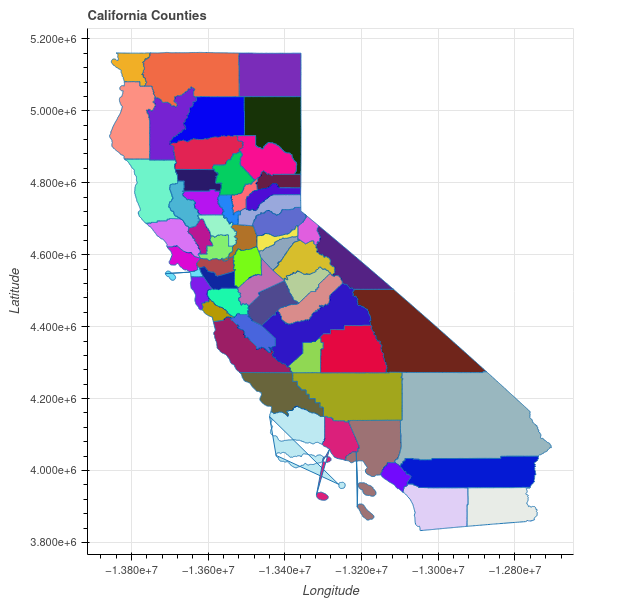

# WKTPlot

Plot well-known-text strings and shapely geometries with Bokeh!

## Badges

[](https://circleci.com/gh/FuzzFoundation/WKTPlot)
[](https://www.codacy.com/gh/FuzzFoundation/WKTPlot/dashboard?utm_source=github.com;utm_content=FuzzFoundation/WKTPlot&amp;utm_campaign=Badge_Grade)
[](https://www.codacy.com/gh/FuzzFoundation/WKTPlot/dashboard?utm_source=github.com&utm_medium=referral&utm_content=FuzzFoundation/WKTPlot&utm_campaign=Badge_Coverage)

## Installation
```
pip install wktplot
```

## Usage
``` python
from wktplot.wkt_plot import WKTPlot

shape = "POLYGON((-124.4009 41.9983,-123.6237 42.0024, ...))"
plot = WKTPlot(title="California", save_dir="/path/to/directory")
plot.add_shape(shape, color="green", line_width=3)
plot.save()
```
WKTPlot supports majority of shapely objects including:
* Point
* MultiPoint
* LineString
* MultiLineString
* LinearRing
* Polygon
* MultiPolygon
* GeometryCollection

Example for plotting from shapefile. Shapefile is of California's county boundaries from [here](https://data.ca.gov/dataset/ca-geographic-boundaries).
```python
from random import randrange
from shapely.geometry import Polygon
from wktplot.wkt_plot import WKTPlot

import shapefile  # pyshp module

def get_rand_color():
    return f"#{randrange(0, 0xffffff):0>6x}"

plot = WKTPlot(title="California Counties", save_dir"~/scratch")
with shapefile.Reader("~/scratch/ca_counties/CA_Counties/CA_Counties_TIGER2016.shp") as shp:
    for shape in shp.shapes():
        p = Polygon(shape.points)
        plot.add_shape(p, fill_color=get_rand_color())
plot.save()
```
Which will result in this output:


## Additional Info
WKTPlot supports Bokeh's stylization parameters for customizing the look of added elemented. See this guide for more info: https://docs.bokeh.org/en/latest/docs/user_guide/styling.html

## Future Plans
* Add native support for visualizing GeoDataframes and shapefiles.
* Make web view more interactive.
